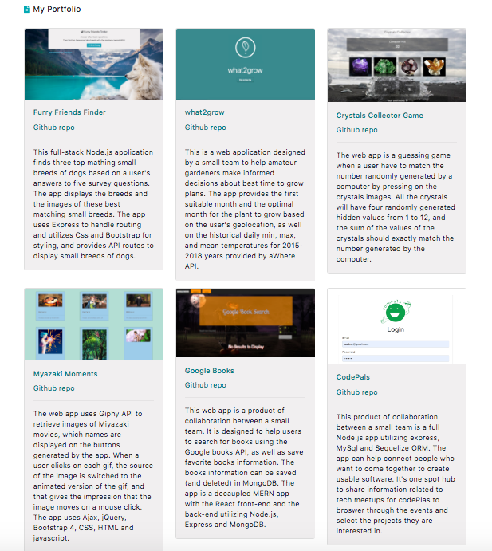

### My Portfolio

### by Halina Zmachynskaya
__________________________________________________________________
The web site consists of two pages - index.html and portfolio.html  and presents a portfolio. The portfolio.html page uses boottstrap cards. All pages utilize the bootstrap grid system and its responsive design capabilities. 

#### Portfolio Page:
The portfolio.html page uses bootstrap cards and have links to the deployed projects/apps and the corresponding github repos.

__________________________________________________________________

Techologies used:
* HTML
* CSS
* Bootstrap 4
__________________________________________________________________
